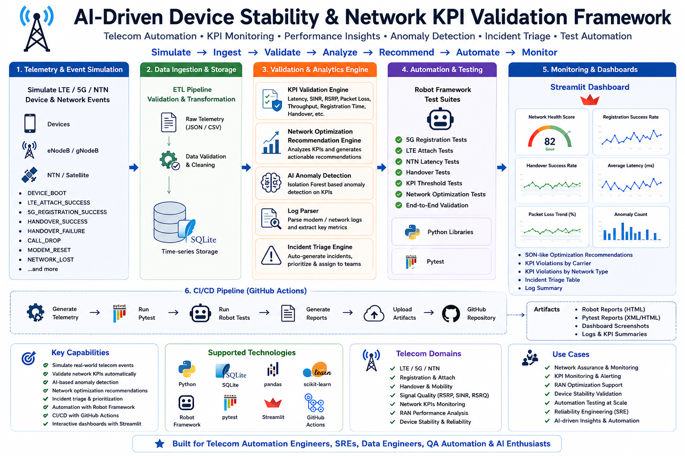

# Telecom Device Stability & Network KPI Validation Framework

Demo framework for telecom device telemetry, LTE/5G/NTN event simulation, KPI validation, SON recommendations, modem log parsing, dashboard reporting, and CI/CD automation.



The project stays local and beginner-friendly: Python, pandas, SQLite, pytest, Robot Framework, and Streamlit. It does not require cloud services or Docker.

This is a demo simulation based on the type of device stability, telecom KPI validation, network assurance, and automation work I was exposed to in a company environment. It uses synthetic data and local tooling so the workflow can be shared publicly without proprietary systems, logs, or customer data.

## Architecture

```text
Telemetry Generator
  -> CSV files in data/raw and data/reference
  -> SQLite Ingestion and Data Quality Validation
  -> KPI Validation Engine
  -> SON Recommendation Engine
  -> Streamlit Dashboard
  -> Pytest + Robot Framework CI Checks

Sample Modem Logs
  -> Log Parser
  -> Unit Tests
```

## Telecom Use Case

This project simulates a network assurance workflow used by telecom automation and SRE teams. It generates device events for LTE attach, 5G registration, NTN registration, handovers, call drops, modem resets, and network recovery. It then validates radio and transport KPIs such as RSRP, RSRQ, SINR, latency, jitter, packet loss, throughput, registration time, and handover status.

The output helps identify weak coverage, interference, backhaul congestion, high latency, mobility failures, and registration signaling problems.

## Key Features

- Telecom telemetry generator with carrier, network type, cell ID, firmware, event type, RF metrics, latency, packet loss, throughput, and status.
- SQLite ETL pipeline with clean, rejected, summary, KPI, and SON tables.
- KPI validation rules for latency, packet loss, SINR, RSRP, registration time, and handover failures.
- Rule-based SON recommendations by problematic cell.
- Robot Framework suites for 5G registration, LTE attach, NTN latency, handover, KPI failures, and SON recommendations.
- Sample modem logs and parser for registration, weak signal, handover failure, call drop, and modem reset counts.
- Streamlit dashboard for network health score, success rates, latency, packet loss trend, weak signal count, SON recommendations, and KPI violations.
- GitHub Actions pipeline for data generation, ingestion, pytest, Robot Framework, and Robot report artifacts.

## Run Locally

```bash
pip install -r requirements.txt
python src/generate_data.py
python src/ingest.py
```

The SQLite database is created at:

```text
database/telemetry.db
```

## Run Pytest

```bash
pytest tests -v
```

## Run Robot Framework Tests

Generate and ingest telemetry first, then run:

```bash
robot --outputdir robot_results robot_tests
```

Robot reports will be written to:

```text
robot_results/
```

## Launch Dashboard

```bash
streamlit run dashboard/app.py
```

## Main Tables

| Table | Purpose |
| --- | --- |
| `raw_device_telemetry` | Raw generated telemetry events |
| `clean_telemetry_events` | Valid records with KPI validation columns |
| `rejected_telemetry_events` | Invalid records isolated during ETL |
| `daily_stability_summary` | Daily reporting summary |
| `kpi_validation_summary` | PASS/WARN/FAIL KPI counts |
| `son_recommendations` | Rule-based cell optimization recommendations |

## KPI Rules

| Rule | Result |
| --- | --- |
| `latency_ms > 150` | FAIL |
| `packet_loss_pct > 2` | FAIL |
| `sinr < 10` | WARN |
| `rsrp < -110` | WARN |
| `registration_time_ms > 3000` | FAIL |
| `handover_status == FAILED` | FAIL |

## Future Enhancements

- AI-driven anomaly detection using IsolationForest or similar lightweight local models.
- Incident and backlog triage that converts KPI failures into prioritized P1-P4 action items.
- Suggested owners for generated incidents, such as RAN Team, Core Team, Device Team, or Transport Team.
- Trend-based alerting for repeated failures by cell, carrier, firmware, or network type.

Note: AI anomaly detection and incident triage are intentionally deferred and can be added later as separate modules.
